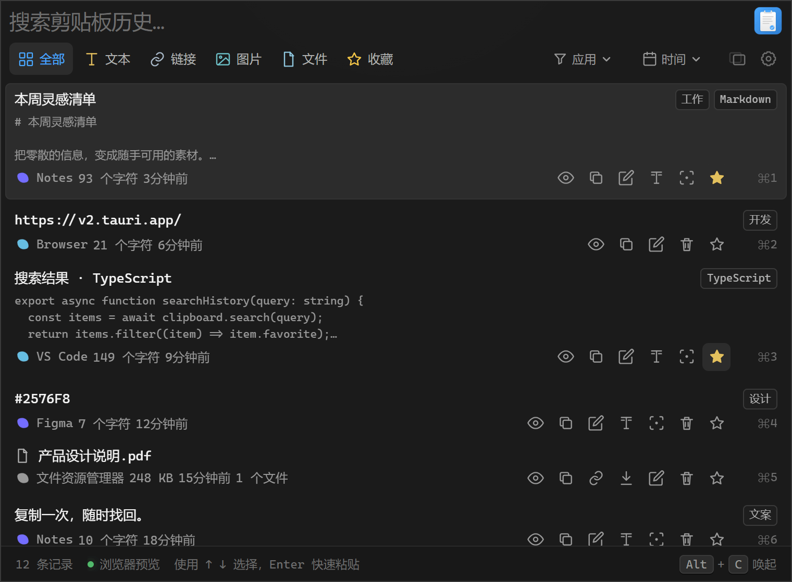
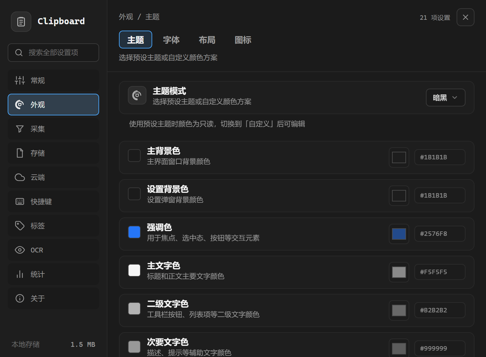
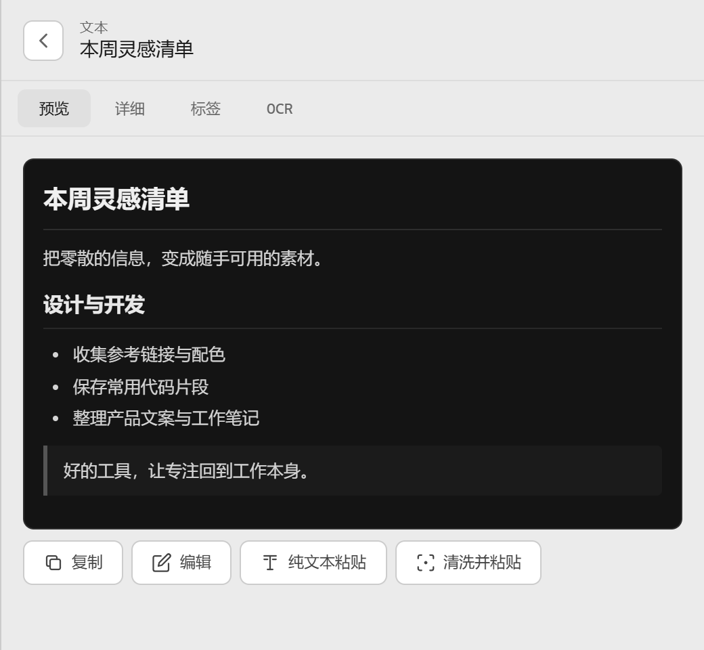
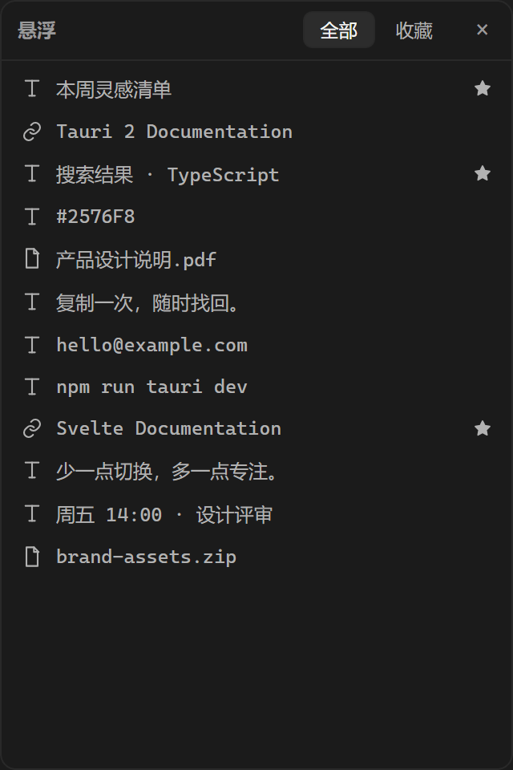

<h1 align="center">
  <picture>
    <source media="(prefers-color-scheme: dark)" srcset="static/logo-dark.png">
    
  </picture>
</h1>

<p align="center">
  <strong>高性能 · 本地优先 · 全平台剪贴板管理器</strong><br>
  <sub>Built with Tauri 2 · Rust · Svelte 5 · Tantivy · SQLite</sub>
</p>

<p align="center">
  
  
  
  
  
</p>

> **English**: An English version of this document is available at [README_EN.md](README_EN.md).

---

## 简介

Clipboard Desktop 是一款 **高性能、跨平台、本地优先**的剪贴板管理工具。它在后台静默运行，持续记录剪贴板历史。通过全局热键（默认
`Alt+C`，**Windows 独有**）一键唤起，支持 **全文搜索（含中文分词）**、 **图片 OCR 文字识别**、收藏、编辑、快速粘贴等操作。

> **隐私承诺**：默认所有数据存储在本地，不包含任何遥测。OCR 完全离线运行，无需联网。仅在以下用户显式操作时访问网络：配置并启用
> S3 同步（数据将上传至你自己的存储桶）、检查应用更新、下载 OCR 模型；"仅本地模式"开启时更新检查与模型下载会被阻止。

### 快速预览

```
Alt+C 唤起 → 键入关键词搜索 → ↑↓ 导航 → Enter 粘贴
```

> 全局热键与「粘贴到上一个窗口」已有 macOS/X11 原生后端，仍待对应平台验收；Wayland 热键依赖 portal 授权，快速粘贴限 Sway/Hyprland + wtype。权限和桌面限制详见
> [多平台支持状态](#多平台支持状态)。

---

## 界面预览

当前界面的中文演示，使用虚构示例数据；点击图片查看原图。

<table width="100%">
  <tr>
    <td width="50%" align="center" valign="top">
      <a href="static/screenshots/zh-CN/main.png"></a><br>
      <sub><b>剪贴板历史</b> · 搜索、筛选与快捷操作</sub>
    </td>
    <td width="50%" align="center" valign="top">
      <a href="static/screenshots/zh-CN/settings.png"></a><br>
      <sub><b>外观设置</b> · 主题、字体与布局</sub>
    </td>
  </tr>
</table>
<table width="100%">
  <tr>
    <td width="62%" align="center" valign="top">
      <a href="static/screenshots/zh-CN/detail.png"></a><br>
      <sub><b>内容详情</b> · Markdown 预览与编辑</sub>
    </td>
    <td width="38%" align="center" valign="top">
      <a href="static/screenshots/zh-CN/float.png"></a><br>
      <sub><b>悬浮剪贴板</b> · 常用内容随手取用</sub>
    </td>
  </tr>
</table>

## 核心特性

<table>
<tr>
<td width="50%">

### 📋 剪贴板记录

- **文本** / **链接** / **图片** / **文件** 四种内容类型
- 智能内容识别：邮箱、电话、颜色值、日期、货币、IP
- 快速操作：一键发邮件、拨号、打开链接、查看日期
- 富文本（HTML / RTF）记录与 **带格式粘贴**、 **清洗并粘贴**（去除追踪参数与多余空白）
- 内容哈希去重，避免重复记录
- 自触发抑制，防止捕获自身写入
- 历史上限 10,000 条 / 30 天保留（可配置）

### 🔍 全文搜索

- Tantivy 全文检索引擎，N-gram 中文分词
- 多关键词无序 AND 匹配 + BM25 相关性评分
- 自然语言日期搜索（"昨天"、"上周"）
- 来源应用名称参与搜索
- 搜索建议（下拉 / 内联提示）
- 8 万条记录下索引查询 P95 < 0.1ms（[实测](docs/SEARCH_OPTIMIZATION_REPORT.md#32-搜索延迟-p50p95毫秒)）；首次搜索若遇索引积压（批量导入 / 批量恢复）需先排空，1 万条积压约 227ms

### 🏷️ 标签系统

- 为任意条目打标签，标签参与全文搜索与列表筛选
- 标签管理面板：批量重命名 / 删除 / 着色，颜色预设 + 自定义
- 卡片标签：点击切换筛选，右键重命名 / 改色

### 🔒 隐私与安全

- **本地优先**：所有数据存储于本地 SQLite，无遥测
- **剪贴板暂停**：一键暂停/恢复记录
- **忽略应用**：密码管理器自动识别（1Password、Bitwarden、KeePass 等）
- **敏感内容**：可配置正则匹配模式
- **端到端同步**（可选）：S3 存储桶 + AES-256-GCM 加密与口令派生密钥，详见 `docs/SYNC_V1.md`

</td>
<td width="50%">

### 🖼️ 图片 OCR

- PP-OCR 引擎，本地运行无需联网
- 后台任务队列，增量写入搜索索引
- 模型选择 / 下载 / 安装 / 热重载
- 识别状态面板，可查看 OCR 文本

### 🎨 现代 UI

- Svelte 5 响应式界面
- 虚拟滚动，万级列表流畅滚动
- 详情面板：覆盖切入 / 左右分栏双模式
- 图片全屏查看器，支持缩放拖拽
- 自定义主题颜色（20 个 CSS 变量），暗 / 亮预设
- 系统托盘，透明窗口，开机自启

### ⚙️ 完善设置

- 双栏设置界面，分类导航 + 全局搜索
- 常规 / 外观 / 采集 / 标签 / 存储 / 快捷键 / OCR / 统计 / 关于
- 5 个独立字体大小滑杆（主文字 / 次要文字 / 微小文字 / 卡片标题 / 卡片预览），逐项像素级调节
- 性能监控面板（启动耗时、搜索延迟、内存占用）
- 自定义数据 / 存储目录，数据库修复，搜索索引重建
- 毛玻璃窗口特效、版本检查更新、中英双语界面（可自动跟随系统语言）

### 🔌 扩展能力

- **CLI 命令行**：`clipboard list / search / copy / paste / delete / export / stats`
- **本地 API**：仅限环回地址的 HTTP 接口，Bearer token 鉴权
- **导入导出**：JSON / CSV / 纯文本，支持 **PPaste 备份导入**
- **快捷键系统**：应用内快捷键（跨平台）+ 全局热键；双击修饰键支持 Windows，macOS/X11 采样后端待验收，Wayland 不支持

</td>
</tr>
</table>

---

## 技术栈

<p align="left">
  
</p>

| 层级     | 技术                       | 说明                                                       |
| :------- | :------------------------- | :--------------------------------------------------------- |
| 桌面框架 | **Tauri 2**                | 轻量跨平台桌面壳，Rust 后端 + Web 前端                     |
| 后端     | **Rust** (edition 2021)    | 剪贴板监听、存储、搜索、OCR、快捷键                        |
| 数据库   | **SQLite** (rusqlite 0.40) | 版本化 Schema，仓储模式，自动备份恢复                      |
| 搜索引擎 | **Tantivy 0.26**           | 全文检索，自定义 N-gram 分词（中文友好）                   |
| OCR      | **oar-ocr 0.9** (PP-OCR)   | 本地 ONNX 推理，支持 Tesseract 备选                        |
| 前端     | **Svelte 5 + SvelteKit**   | Runes 响应式语法，SPA 模式                                 |
| 构建     | **Vite 8 + Cargo**         | 前端 HMR + Rust 增量编译                                   |
| 打包     | **Tauri Bundler**          | NSIS (Windows) / App Bundle (macOS) / Deb/AppImage (Linux) |

---

## 快速开始

### 环境要求

- **Node.js** >= 20.19（Vite 8 要求；推荐 22 / 24，CI 使用 24）
- **Rust** 稳定版工具链
- 对应平台的 [Tauri 2 系统依赖](https://v2.tauri.app/start/prerequisites/)

### 安装

```powershell
# Windows
winget install Rustlang.Rustup
winget install OpenJS.NodeJS.LTS
```

```sh
# macOS
brew install node
curl --proto '=https' --tlsv1.2 -sSf https://sh.rustup.rs | sh
```

```sh
# Linux (Ubuntu/Debian)
sudo apt install -y libwebkit2gtk-4.1-dev libappindicator3-dev \
  librsvg2-dev patchelf libssl-dev libgtk-3-dev libdbus-1-dev \
  libjavascriptcoregtk-4.1-dev libsoup-3.0-dev
curl --proto '=https' --tlsv1.2 -sSf https://sh.rustup.rs | sh
```

### 开发运行

```sh
npm install          # 安装前端依赖
npm run tauri dev    # 启动桌面应用（热重载）
npm run dev          # 或仅运行前端（浏览器预览 + 演示数据）
```

### 生产构建

```sh
npm run tauri build  # 在 src-tauri/target/release/bundle/ 生成安装包
```

---

## 多平台支持状态

| 功能                       | Windows       | macOS                                   | Linux X11                               | Linux Wayland                               |
| :------------------------- | :------------ | :-------------------------------------- | :-------------------------------------- | :------------------------------------------ |
| 读取剪贴板文本             | ✅ 原生 Win32 | ✅ 原生 ObjC FFI                        | ✅ 原生 Xlib FFI                        | ⚠️ `wl-paste`                               |
| 写入剪贴板（含自触发标记） | ✅ 原生 Win32 | ⚠️ `pbcopy`（无标记）                   | ⚠️ `xclip`（无标记）                    | ⚠️ `wl-copy`（无标记）                      |
| 读取剪贴板图片             | ✅ 原生 Win32 | ⚠️ `pngpaste` / `osascript`+`sips`      | ⚠️ `xclip`                              | ⚠️ `wl-paste`                               |
| 读取文件路径               | ✅ 原生 Win32 | ⚠️ 原生 `NSFilenamesPboardType`¹        | ⚠️ `xclip`（uri-list）                  | ⚠️ `wl-paste`（uri-list）                   |
| 获取前台应用               | ✅ 原生 Win32 | ✅ 原生 ObjC FFI                        | ✅ 原生 Xlib + `/proc`                  | ⚠️ `swaymsg`/`hyprctl`/`xdotool`            |
| 提取应用图标               | ✅ 原生 Win32 | ⚠️ `plutil` + `sips`                    | ⚠️ freedesktop 图标                     | ⚠️ freedesktop 图标                         |
| 全局热键 / 双击修饰键      | ✅ 原生 Win32 | ⚠️ 原生组合键 / 10ms 双击采样（待验证） | ⚠️ 原生组合键 / 10ms 双击采样（待验证） | ⚠️ GlobalShortcuts portal；不支持修饰键双击 |
| 快速粘贴到上一个窗口       | ✅ 原生 Win32 | ⚠️ 原生激活 + CGEvent（需辅助功能权限） | ⚠️ 原生 EWMH + XTest                    | ⚠️ Sway/Hyprland + wtype                    |
| 窗口透明 / 毛玻璃特效      | ✅ 原生 Win32 | ⚠️ 原生透明度 / Vibrancy（待平台验证）  | ⚠️ GTK 透明度 / KWin 兼容模糊请求       | ⚠️ GTK 透明度；模糊由合成器控制             |
| 富文本 RTF 采集            | ✅ 原生 Win32 | ⚠️ 原生 public.rtf（待平台验证）        | ⚠️ `xclip` / `wl-paste`                 | ⚠️ `xclip` / `wl-paste`                     |
| 剪贴板序列号（多格式竞态） | ✅ 原生 Win32 | ⚠️ 原生 changeCount（待平台验证）       | ⚠️ 双读校验与有限重试                   | ⚠️ 双读校验与有限重试                       |
| 单实例唤醒已有实例         | ✅ 原命名事件 | ⚠️ 本地认证 IPC（待平台验证）           | ⚠️ 本地认证 IPC（待平台验证）           | ⚠️ 本地认证 IPC（窗口激活由合成器决定）     |
| 秘密存储（OS 级钥匙串）    | ✅ DPAPI      | ⚠️ Keychain（不可达则明文回退）         | ⚠️ Secret Service（同左）               | ⚠️ Secret Service（同左）                   |

- ✅ **原生 API** — 直接 FFI 调用系统接口，无外部依赖
- ⚠️ **部分支持** — 依赖外部命令行工具，或受来源应用写入格式等条件限制
- ❌ **未实现** — 返回空值/错误，尚不支持

> **注意**：剪贴板变更检测按平台采用不同机制——Windows 使用原生剪贴板序列号事件驱动；Linux 在 X11 下通过 XFixes 事件、在 Wayland 下通过 data-control 协议事件驱动（协议不可用时回退 500ms 轮询）；macOS 无推送 API，使用 500ms 轮询。先比对文本，无文本时再比对文件路径与图片内容，因此图片/文件复制也能被采集。自触发防护不依赖剪贴板私有标记（写入命令行工具无法携带标记），而是将应用自身写入的内容哈希登记在内存守卫中，采集时比对跳过。

> **热键说明**：macOS/X11 组合键经 `global-hotkey` 原生注册，双击修饰键经 10ms 按键状态采样识别（短于采样间隔的按键可能漏检，macOS 需要输入监控权限）。Wayland 通过 GlobalShortcuts portal 请求桌面授权，只在绑定成功后报告可用；修饰键双击无通用接口，明确报错。非 Windows 实现仍待对应平台 CI 和桌面实测。快速粘贴新增 macOS/X11 原生后端；Wayland 仅在 Sway/Hyprland 与 wtype 可用时支持。会持续记录外部前台窗口，并在恢复焦点后核对窗口/进程身份。

> ¹ macOS 文件路径读取已是原生 `NSFilenamesPboardType` 实现（`platform/macos.rs::read_nsfilenames_paths`），不依赖外部命令，
> 但整个文件在 `#[cfg(target_os = "macos")]` 之下、Windows 门禁不编译，因此仍标为 ⚠️ 而非 ✅——只有 macOS CI 变绿才可改判。

---

## 开发命令

| 命令                   | 说明                                                  |
| :--------------------- | :---------------------------------------------------- |
| `npm run dev`          | 启动 Vite 开发服务器（仅前端）                        |
| `npm run build`        | 前端生产构建                                          |
| `npm run tauri dev`    | Tauri 桌面应用开发模式                                |
| `npm run tauri build`  | Tauri 桌面应用生产构建                                |
| `npm run check`        | TypeScript / Svelte 类型检查                          |
| `npm run format`       | 代码格式化（Prettier + `cargo fmt`）                  |
| `npm run format:check` | 格式检查（不修改文件）                                |
| `npm run test:rust`    | Rust 单元测试                                         |
| `npm run lint:rust`    | Rust Clippy 检查                                      |
| `npm run verify`       | **全量检查**：格式 + 类型 + 构建 + Rust 测试 + Clippy |

### 推荐 IDE 插件

- [Svelte for VS Code](https://marketplace.visualstudio.com/items?itemName=svelte.svelte-vscode)
- [Tauri](https://marketplace.visualstudio.com/items?itemName=tauri-apps.tauri-vscode)
- [rust-analyzer](https://marketplace.visualstudio.com/items?itemName=rust-lang.rust-analyzer)

---

## 项目结构

```
clipboard/
├── src/                         # Svelte 5 前端 (SPA)
│   ├── routes/
│   │   ├── +page.svelte         # 主界面（剪贴板列表、搜索、详情）
│   │   └── settings/+page.svelte # 设置界面
│   └── lib/
│       ├── components/          # 可复用组件
│       ├── services/            # Tauri IPC 封装层
│       ├── types/               # TypeScript 类型定义
│       ├── i18n/                # 国际化（zh-CN / en）
│       ├── utils/               # 工具函数
│       └── data/                # 浏览器预览演示数据
├── src-tauri/                   # Rust 后端
│   ├── tauri.conf.json          # Tauri 2 配置
│   ├── Cargo.toml               # Rust 依赖
│   └── src/
│       ├── main.rs              # 入口
│       ├── lib.rs               # 命令注册与应用初始化
│       ├── cli/                 # CLI 命令行解析
│       ├── commands/            # Tauri IPC 命令
│       ├── config/              # 配置读写与默认值
│       ├── domain/              # 领域模型
│       ├── storage/             # SQLite 数据库与仓储
│       ├── tags/                # 标签领域逻辑
│       ├── search/              # Tantivy 搜索引擎与索引同步
│       ├── ocr/                 # OCR 引擎与任务队列
│       ├── keyboard/            # 快捷键解析匹配
│       ├── platform/            # 平台适配（Windows / macOS / Linux）
│       ├── content/             # 内容检测、哈希、缩略图、清洗
│       ├── privacy/             # 隐私管理
│       ├── memory/              # 内存诊断
│       ├── performance/         # 性能监控
│       ├── sync/                # S3 端到端同步适配层
│       ├── crates/clipboard-sync/ # 同步引擎与加密 wire 协议（独立 crate）
│       └── export/              # 导入导出
├── docs/                        # 设计文档
│   ├── SEARCH.md                # 搜索架构
│   ├── OCR.md                   # OCR 架构
│   ├── SYNC_V1.md               # 同步协议
│   ├── PITFALLS.md              # 开发陷阱与约定
│   └── SEARCH_OPTIMIZATION_REPORT.md # 搜索优化基准测试报告
├── static/                      # 静态资源
├── CONTRIBUTING.md              # 贡献指南
└── package.json
```

---

## 文档

| 文档                                                                     | 内容                                          |
| :----------------------------------------------------------------------- | :-------------------------------------------- |
| [CONTRIBUTING.md](CONTRIBUTING.md)                                       | 开发环境搭建、编码规范、提交规范              |
| [docs/SEARCH.md](docs/SEARCH.md)                                         | 搜索架构：Tantivy 索引、N-gram 分词、查询策略 |
| [docs/OCR.md](docs/OCR.md)                                               | OCR 管线：引擎选择、模型管理、任务队列        |
| [docs/PITFALLS.md](docs/PITFALLS.md)                                     | Svelte 5 / Tauri / Rust 开发陷阱              |
| [docs/DEFAULTS_AND_PRIVACY.md](docs/DEFAULTS_AND_PRIVACY.md)             | 默认策略与隐私边界                            |
| [docs/SEARCH_OPTIMIZATION_REPORT.md](docs/SEARCH_OPTIMIZATION_REPORT.md) | 搜索优化对比测试报告                          |

---

## 贡献

欢迎提交 Issue 和 Pull Request。请先阅读 [CONTRIBUTING.md](CONTRIBUTING.md) 了解开发规范和提交流程。

提交消息格式遵循 **gitmoji 约定**：

```
<gitmoji> <type>[<scope>]: <message>
```

示例：`✨ feat[search]: add backend SearchResultCache` | `🐛 fix[viewer]: handle window close state`

---

## 许可证

AGPL-3.0 © Clipboard Desktop Contributors

---

## 推广

- [Linux.do](https://linux.do)
