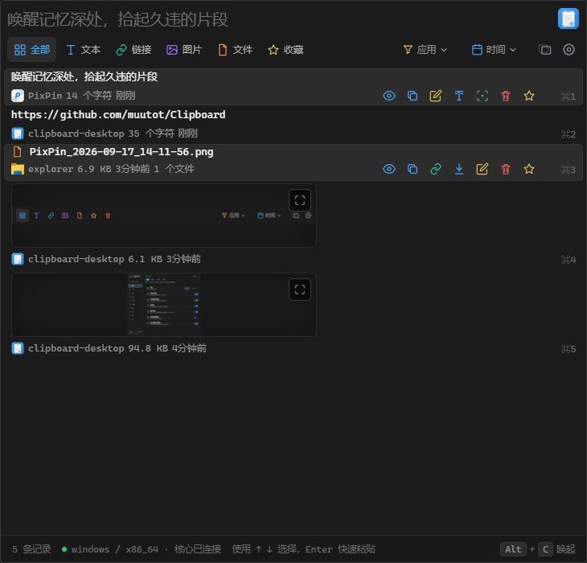
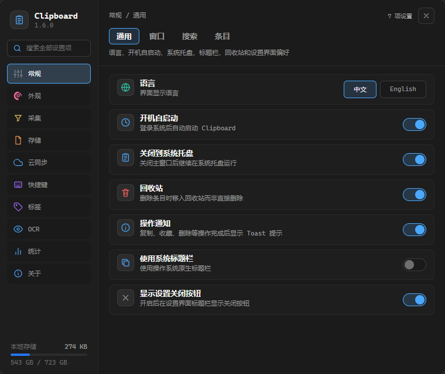
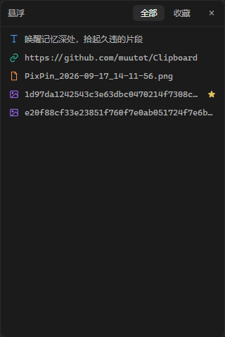
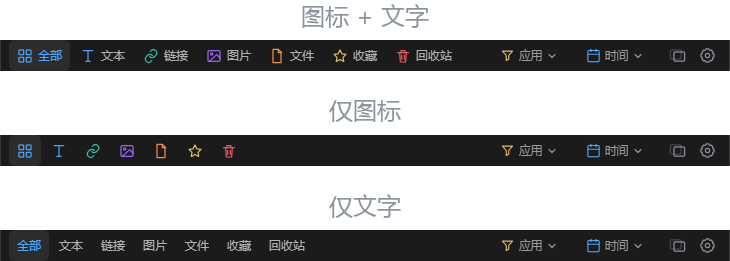

<h1 align="center">
  <picture>
    <source media="(prefers-color-scheme: dark)" srcset="static/logo-dark.png">
    
  </picture>
</h1>

<p align="center">
  <strong>High-performance · Local-first · Cross-platform clipboard manager</strong><br>
  <sub>Built with Tauri 2 · Rust · Svelte 5 · Tantivy · SQLite</sub>
</p>

<p align="center">
  
  
  
  
  
</p>

---

> [中文文档](README.md)

## Introduction

Clipboard Desktop is a **high-performance, cross-platform, local-first** clipboard manager. It runs quietly in the background and keeps recording your clipboard history. Summon it with a global hotkey (default `Alt+C`, **Windows only**) and **full-text search (with Chinese tokenization)**, **image OCR text recognition**, favorites, editing, and quick paste are all one keystroke away.

> **Privacy commitment**: All data is stored locally by default, with no telemetry. OCR runs fully offline and needs no network. The app only uses the network when you explicitly: configure and enable S3 sync (your data goes to your own bucket), check for updates, or download OCR models. With "local-only mode" on, update checks and model downloads are blocked.

### Quick glance

```
Alt+C to open → type keywords to search → ↑↓ to navigate → Enter to paste
```

> Global hotkeys and "paste to the previous window" are currently **Windows only**; macOS and Linux have no system-level registration path yet, so shortcuts only work while the main window is focused (see [Platform support status](#platform-support-status)).

---

## Screenshots

> The main window is on the left and the settings window on the right of the top row; the floating panel is on the left below, next to the **toolbar style comparison** (top to bottom: **icon + text**, **icon only**, **text only**).

<p align="center">
  
  
</p>

<p align="center">
  
  
</p>

## Features

<table>
<tr>
<td width="50%">

### 📋 Clipboard history

- **Text** / **link** / **image** / **file** content types
- Smart content detection: email, phone, color values, dates, currency, IP
- Quick actions: email, dial, open link, view date
- Rich text (HTML / RTF) capture with **paste with formatting** and **clean & paste** (strips tracking parameters and extra whitespace)
- Content-hash deduplication
- Self-trigger suppression to avoid capturing its own writes
- 10,000 items / 30 days retention by default (configurable)

### 🔍 Full-text search

- Tantivy full-text engine, N-gram Chinese tokenization
- Unordered multi-keyword AND matching + BM25 ranking
- Natural-language date search ("yesterday", "last week")
- Source application name participates in search
- Search suggestions (dropdown / inline hints)
- Index query P95 < 0.1ms at 80k items ([measured](docs/SEARCH_OPTIMIZATION_REPORT.md)); the first search may need to drain a large index backlog (batch import/recovery), ~227ms per 10k backlog

### 🏷️ Tags

- Tag any item; tags participate in full-text search and list filtering
- Tag management panel: batch rename / delete / color, presets + custom colors
- Card tags: click to filter, right-click to rename / recolor

### 🔒 Privacy & security

- **Local-first**: all data in local SQLite, no telemetry
- **Pause**: one-click pause/resume of capture
- **Ignore apps**: automatic detection of password managers (1Password, Bitwarden, KeePass, …)
- **Sensitive content**: configurable regex patterns
- **End-to-end sync** (optional): S3 bucket + AES-256-GCM with password-derived keys, see `docs/SYNC_V1.md`

</td>
<td width="50%">

### 🖼️ Image OCR

- PP-OCR engine, runs locally with no network
- Background task queue, incremental index updates
- Model selection / download / install / hot reload
- Recognition status panel with OCR text view

### 🎨 Modern UI

- Svelte 5 reactive interface
- Virtual scrolling for smoothly rendering tens of thousands of items
- Detail panel: overlay mode and side-by-side mode
- Image fullscreen viewer with zoom and drag
- Custom theme colors (20 CSS variables), dark / light presets
- System tray, transparent windows, autostart

### ⚙️ Complete settings

- Two-column settings UI with category navigation + global search
- General / Appearance / Capture / Tags / Storage / Shortcuts / OCR / Stats / About
- 5 independent font-size sliders (body / secondary / micro / card title / card preview) with pixel-level control
- Performance panel (startup time, search latency, memory)
- Custom data / storage directories, database repair, search index rebuild
- Frosted-glass window effect, version checks, bilingual UI (follows the OS language)

### 🔌 Extensibility

- **CLI**: `clipboard list / search / copy / paste / delete / export / stats`
- **Local API**: loopback-only HTTP interface with Bearer token auth
- **Import/export**: JSON / CSV / plain text, **PPaste backup import** supported
- **Shortcuts**: in-app shortcuts (cross-platform) + global hotkey and double-modifier (Shift+Shift, **Windows only**)

</td>
</tr>
</table>

---

## Tech stack

<p align="left">
  
</p>

| Layer    | Technology                 | Notes                                                         |
| :------- | :------------------------- | :------------------------------------------------------------ |
| Desktop  | **Tauri 2**                | Lightweight cross-platform shell, Rust backend + web frontend |
| Backend  | **Rust** (edition 2021)    | Clipboard watch, storage, search, OCR, shortcuts              |
| Database | **SQLite** (rusqlite 0.40) | Versioned schema, repository pattern, backup/restore          |
| Search   | **Tantivy 0.26**           | Full-text, custom N-gram tokenizer (Chinese-friendly)         |
| OCR      | **oar-ocr 0.9** (PP-OCR)   | Local ONNX inference, Tesseract fallback                      |
| Frontend | **Svelte 5 + SvelteKit**   | Runes reactivity, SPA mode                                    |
| Build    | **Vite 8 + Cargo**         | Frontend HMR + incremental Rust builds                        |
| Bundle   | **Tauri Bundler**          | NSIS (Windows) / App Bundle (macOS) / Deb/AppImage (Linux)    |

---

## Getting started

### Requirements

- **Node.js** >= 20.19 (Vite 8 requirement; 22 / 24 recommended, CI uses 24)
- **Rust** stable toolchain
- [Tauri 2 system dependencies](https://v2.tauri.app/start/prerequisites/) for your platform

### Install

```powershell
# Windows
winget install Rustlang.Rustup
winget install OpenJS.NodeJS.LTS
```

```sh
# macOS
brew install node
curl --proto '=https' --tlsv1.2 -sSf https://sh.rustup.rs | sh
```

```sh
# Linux (Ubuntu/Debian)
sudo apt install -y libwebkit2gtk-4.1-dev libappindicator3-dev \
  librsvg2-dev patchelf libssl-dev libgtk-3-dev libdbus-1-dev \
  libjavascriptcoregtk-4.1-dev libsoup-3.0-dev
curl --proto '=https' --tlsv1.2 -sSf https://sh.rustup.rs | sh
```

### Develop

```sh
npm install          # install frontend dependencies
npm run tauri dev    # run the desktop app (hot reload)
npm run dev          # or frontend only (browser preview + demo data)
```

### Production build

```sh
npm run tauri build  # installers land in src-tauri/target/release/bundle/
```

---

## Platform support status

| Feature                             | Windows         | macOS                                        | Linux X11                | Linux Wayland                    |
| :---------------------------------- | :-------------- | :------------------------------------------- | :----------------------- | :------------------------------- |
| Read clipboard text                 | ✅ Native Win32 | ✅ Native ObjC FFI                           | ✅ Native Xlib FFI       | ⚠️ `wl-paste`                    |
| Write clipboard (self-trigger flag) | ✅ Native Win32 | ⚠️ `pbcopy` (no flag)                        | ⚠️ `xclip` (no flag)     | ⚠️ `wl-copy` (no flag)           |
| Read clipboard image                | ✅ Native Win32 | ⚠️ `pngpaste` / `osascript`+`sips`           | ⚠️ `xclip`               | ⚠️ `wl-paste`                    |
| Read file paths                     | ✅ Native Win32 | ⚠️ Native `NSFilenamesPboardType`¹           | ⚠️ `xclip` (uri-list)    | ⚠️ `wl-paste` (uri-list)         |
| Foreground application              | ✅ Native Win32 | ✅ Native ObjC FFI                           | ✅ Native Xlib + `/proc` | ⚠️ `swaymsg`/`hyprctl`/`xdotool` |
| Extract app icons                   | ✅ Native Win32 | ⚠️ `plutil` + `sips`                         | ⚠️ freedesktop icons     | ⚠️ freedesktop icons             |
| Global hotkey / double modifier     | ✅ Native Win32 | ❌ Not implemented                           | ❌ Not implemented       | ❌ Not implemented               |
| Quick paste to previous window      | ✅ Native Win32 | ❌ Not implemented                           | ❌ Not implemented       | ❌ Not implemented               |
| Window transparency / blur          | ✅ Native Win32 | ❌ Not implemented                           | ❌ Not implemented       | ❌ Not implemented               |
| RTF capture                         | ✅ Native Win32 | ❌ Not implemented (HTML is the rich source) | ⚠️ `xclip` / `wl-paste`  | ⚠️ `xclip` / `wl-paste`          |
| Clipboard sequence number           | ✅ Native Win32 | ❌ Not implemented                           | ❌ Not implemented       | ❌ Not implemented               |
| Single-instance wake-up             | ✅ Named event  | ❌ Not implemented                           | ❌ Not implemented       | ❌ Not implemented               |
| Secret storage (OS keychain)        | ✅ DPAPI        | ⚠️ Keychain (falls back to plaintext)        | ⚠️ Secret Service (same) | ⚠️ Secret Service (same)         |

- ✅ **Native API** — direct FFI calls, no external dependencies
- ⚠️ **Partial** — relies on external command-line tools or source-format constraints
- ❌ **Not implemented** — returns empty/error

> **Note**: Change detection differs per platform — Windows uses native clipboard sequence numbers; Linux uses XFixes events (X11) or the data-control protocol (Wayland), falling back to 500ms polling when the protocol is unavailable; macOS has no push API and polls every 500ms. Text is compared first, then file paths and image content, so image/file copies are captured too. Self-trigger protection keeps an in-memory hash guard of content the app itself wrote, rather than relying on private clipboard markers (which CLI writers cannot carry).

> **Hotkey note**: System-wide registration and "paste to the previous window" only have a real implementation via Windows `RegisterHotKey` + low-level keyboard hooks. macOS `MacOSKeyboardHook::register` is still a comment-only outline; non-Windows platforms use `windows_hotkey_stub.rs`, whose thread never fires and whose `restore_window_and_paste` returns "quick paste is only implemented on Windows". `platform_info.rs::current_capabilities` therefore reports `global_shortcut: false` and `quick_paste: false` on macOS / Linux. Shortcut bindings themselves work cross-platform and take effect while the main window is focused.

> ¹ macOS file paths are read via a native `NSFilenamesPboardType` implementation (`platform/macos.rs::read_nsfilenames_paths`), not external commands, but the whole file is behind `#[cfg(target_os = "macos")]` and not compiled on the Windows gate, so it remains ⚠️ until macOS CI goes green.

---

## Development commands

| Command                | Description                                                 |
| :--------------------- | :---------------------------------------------------------- |
| `npm run dev`          | Start the Vite dev server (frontend only)                   |
| `npm run build`        | Frontend production build                                   |
| `npm run tauri dev`    | Tauri desktop development mode                              |
| `npm run tauri build`  | Tauri desktop production build                              |
| `npm run check`        | TypeScript / Svelte type checking                           |
| `npm run format`       | Format code (Prettier + `cargo fmt`)                        |
| `npm run format:check` | Format check (no writes)                                    |
| `npm run test:rust`    | Rust unit tests                                             |
| `npm run lint:rust`    | Rust Clippy                                                 |
| `npm run verify`       | **Full gate**: format + types + build + Rust tests + Clippy |

### Recommended IDE extensions

- [Svelte for VS Code](https://marketplace.visualstudio.com/items?itemName=svelte.svelte-vscode)
- [Tauri](https://marketplace.visualstudio.com/items?itemName=tauri-apps.tauri-vscode)
- [rust-analyzer](https://marketplace.visualstudio.com/items?itemName=rust-lang.rust-analyzer)

---

## Project layout

```
clipboard/
├── src/                         # Svelte 5 frontend (SPA)
│   ├── routes/
│   │   ├── +page.svelte         # Main window (list, search, detail)
│   │   └── settings/+page.svelte # Settings window
│   └── lib/
│       ├── components/          # Reusable components
│       ├── services/            # Tauri IPC wrappers
│       ├── types/               # TypeScript types
│       ├── i18n/                # Internationalization (zh-CN / en)
│       ├── utils/               # Utilities
│       └── data/                # Browser-preview demo data
├── src-tauri/                   # Rust backend
│   ├── tauri.conf.json          # Tauri 2 config
│   ├── Cargo.toml               # Rust dependencies
│   └── src/
│       ├── main.rs              # Entry point
│       ├── lib.rs               # Command registration and app init
│       ├── cli/                 # CLI argument parsing
│       ├── commands/            # Tauri IPC commands
│       ├── config/              # Config read/write and defaults
│       ├── domain/              # Domain models
│       ├── storage/             # SQLite database and repositories
│       ├── tags/                # Tag domain logic
│       ├── search/              # Tantivy search engine and index sync
│       ├── ocr/                 # OCR engine and task queue
│       ├── keyboard/            # Shortcut matching
│       ├── platform/            # Platform adapters (Windows / macOS / Linux)
│       ├── content/             # Content detection, hashing, thumbnails
│       ├── privacy/             # Privacy management
│       ├── memory/              # Memory diagnostics
│       ├── performance/         # Performance monitoring
│       ├── sync/                # S3 end-to-end sync adapter
│       ├── crates/clipboard-sync/ # Sync engine and encrypted wire protocol
│       └── export/              # Import/export
├── docs/                        # Design docs
├── static/                      # Static assets
├── CONTRIBUTING.md              # Contributor guide
└── package.json
```

---

## Docs

| Document                                                                 | Content                                                    |
| :----------------------------------------------------------------------- | :--------------------------------------------------------- |
| [CONTRIBUTING.md](CONTRIBUTING.md)                                       | Dev setup, coding conventions, commit conventions          |
| [docs/SEARCH.md](docs/SEARCH.md)                                         | Search architecture: Tantivy, N-gram tokenization, queries |
| [docs/OCR.md](docs/OCR.md)                                               | OCR pipeline: engines, models, task queue                  |
| [docs/PITFALLS.md](docs/PITFALLS.md)                                     | Svelte 5 / Tauri / Rust pitfalls                           |
| [docs/DEFAULTS_AND_PRIVACY.md](docs/DEFAULTS_AND_PRIVACY.md)             | Default policies and privacy boundaries                    |
| [docs/SEARCH_OPTIMIZATION_REPORT.md](docs/SEARCH_OPTIMIZATION_REPORT.md) | Search optimization benchmark report                       |

---

## Contributing

Issues and pull requests are welcome. Please read [CONTRIBUTING.md](CONTRIBUTING.md) for the development conventions and submission workflow.

Commit messages follow the **gitmoji** convention:

```
<gitmoji> <type>[<scope>]: <message>
```

Examples: `✨ feat[search]: add backend SearchResultCache` | `🐛 fix[viewer]: handle window close state`

---

## License

AGPL-3.0 © Clipboard Desktop Contributors

---

## Links

- [Linux.do](https://linux.do)
